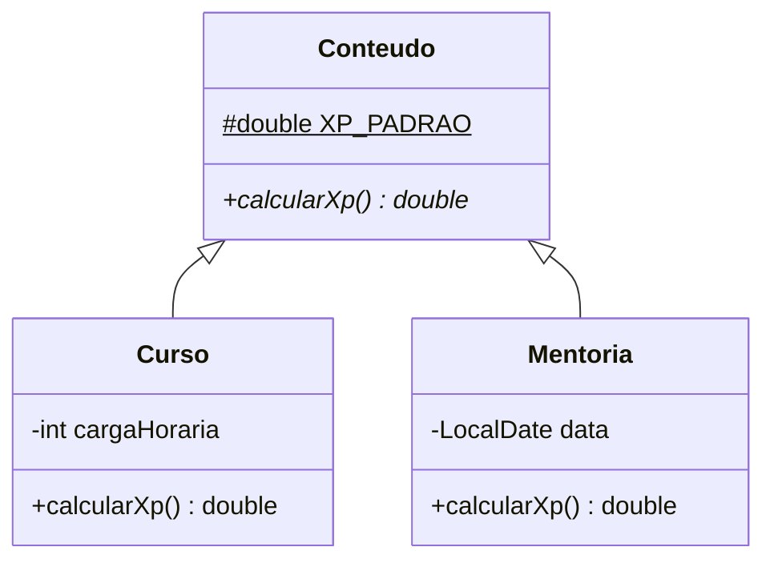

# dio-modelagem-uml
Repositório com o código do desafio "Abstraindo um Bootcamp Usando Orientação a Objetos em Java".

### Diagrama UML

```mermaid
classDiagram
class Conteudo
Conteudo : #double XP_PADRAO$
Conteudo : +calcularXp() double*

class Curso
Curso : -int cargaHoraria
Curso : +calcularXp() double

class Mentoria
Mentoria : -LocalDate data
Mentoria : +calcularXp() double

Conteudo <|-- Curso
Conteudo <|-- Mentoria
```
